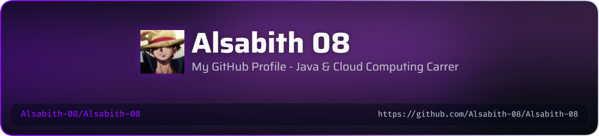

<p align="center">
  
</p>

<h1 align="center">Hi 👋, I'm Alsabith</h1>

<h3 align="center">
Java Developer | Cloud Computing | DSA
</h3>

---

## 👨‍💻 About Me

- 🎓 B.E. Computer Science Engineering Student
- ☕ Learning Java & Data Structures
- ☁️ Building my career in Cloud Computing
- 🧠 Solving DSA problems on LeetCode
- 🚀 Interested in Cloud & Software Engineering
- 🔨 Building practical projects

---

## 🛠️ Tech Stack

**Languages**

☕ Java • 🐍 Python • 💻 C

**Currently Learning**

📚 DSA • ☁️ Cloud Computing • 🌐 Backend Development • 🏗️ System Design

---

## 🚀 Projects

- ⚡ **WattSnapp** — AI Appliance Efficiency Auditor
- 🔗 **RouteFiber** — Blockchain-based project
- 🎵 **Gesture-Based Music Maker** — Gesture-controlled music application

---

---

## 📊 GitHub Stats

<p align="center">
  
</p>

## 🔥 GitHub Streak

<p align="center">
  
</p>

## 🧠 Current Focus

```text
Java
  ↓
DSA
  ↓
Backend Development
  ↓
Cloud Computing
  ↓
System Design


